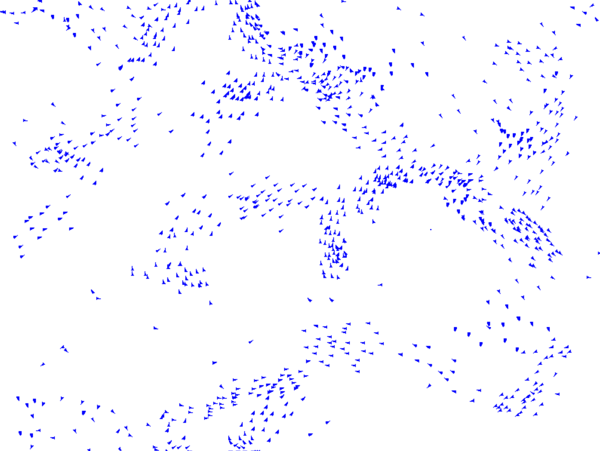

# Boids-Simulation
Implemented the boids flocking algorithm with both an optimized serial CPU implementation and a highly parallel GPU implementations.

CPU implementation uses spatial grid partitioning to minimise the number of boid interactions that need to be checked (boids only need to check if they interact with other boids in their grid and adjacent grids). This can be run locally.

GPU implementation uses CUDA to split boid processing across GPU threads. Computing thousands of boids in parallel on the GPU resulted in orders of magnitude faster computation. Written for execution on computing cluster.

